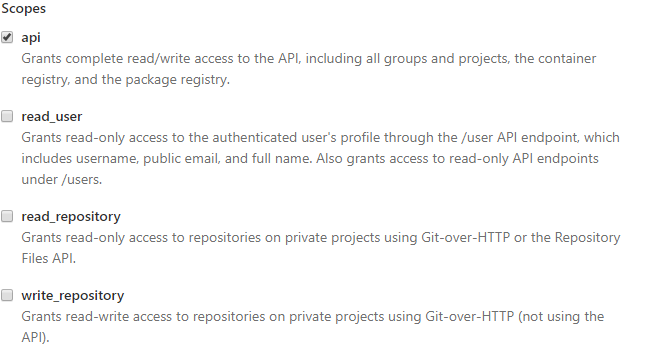
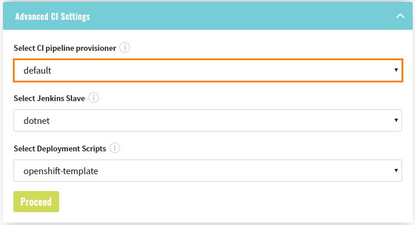

# GitLab Integration

Discover the steps below to apply the GitLab integration correctly:

1. Create access token in **Gitlab**:
    * Log in to **GitLab**;
    * In the top-right corner, click your avatar and select **Settings**;
    * On the **User Settings** menu, select **Access Tokens**;
    * Choose a name and an optional expiry date for the token;
    * In the Scopes block, select the *api* scope for the token;

        

    * Click the **Create personal access token** button.

    *Note: Make sure to save the access token as there won`t be the ability to access it once again.*

2. Install **GitLab plugin** by navigating to *Manage Jenkins* and switching to plugin manager, select the **GitLab Plugin** check box:

    

3. Create Jenkins Credential ID by navigating to *Jenkins -> Credentials -> System -> Global Credentials -> Add Credentials*:

    * Select GitLab API token;
    * Select Global scope;
    * API token - the **Access Token** that was created earlier;
    * ID - the **gitlab-access-token** ID;
    * Description - the description of the current Credential ID;

    

4. Configure **Gitlab plugin** by navigating to *Manage Jenkins -> Configure System* and fill in the **GitLab plugin** settings:

    * Connection name - connection name;
    * Gitlab host URL - a host URL to GitLab;
    * Credentials - credentials with **Access Token** to GitLab (**gitlab-access-token**);

    

5. Create a new Job Provision. Navigate to the Jenkins main page and open the *job-provisions/ci* folder:

    * Click *New Item*;
    * Type the name;
    * Select *Freestyle project* and click OK;
    * Select the *This project is parameterized* check box and add a few input parameters as the following strings:
        * NAME;
        * TYPE;
        * BUILD_TOOL;
        * BRANCH;
        * GIT_SERVER_CR_NAME;
        * GIT_SERVER_CR_VERSION;
        * GIT_SERVER;
        * GIT_SSH_PORT;
        * GIT_USERNAME;
        * GIT_CREDENTIALS_ID;
        * REPOSITORY_PATH;
        * JIRA_INTEGRATION_ENABLED;

    * Check the *Execute concurrent builds if necessary* option;

    * In the **Build** section, perform the following:
        * Select *DSL Script*;
        * Select the *Use the provided DSL script* check box:

   

    * As soon as all the steps above are performed, insert the code:

    ```

    import groovy.json.*
    import jenkins.model.Jenkins

    Jenkins jenkins = Jenkins.instance
    def stages = [:]
    def jiraIntegrationEnabled = Boolean.parseBoolean("${JIRA_INTEGRATION_ENABLED}" as String)
    def commitValidateStage = jiraIntegrationEnabled ? ',{"name": "commit-validate"}' : ''
    def createJFVStage = jiraIntegrationEnabled ? ',{"name": "create-jira-fix-version"}' : ''
    def platformType = "${PLATFORM_TYPE}"
    def buildStage = platformType == "kubernetes" ? ',{"name": "build-image-kaniko"},' : ',{"name": "build-image-from-dockerfile"},'
    
    stages['Code-review-application-python'] = '[{"name": "checkout"},{"name": "compile"},{"name": "test"}]'
    stages['Code-review-application-maven'] = '[{"name": "checkout"},{"name": "compile"},' +
        '{"name": "tests"}, {"name": "sonar"}]'
    stages['Code-review-application-npm'] = stages['Code-review-application-maven']
    stages['Code-review-application-gradle'] = stages['Code-review-application-maven']
    stages['Code-review-application-dotnet'] = stages['Code-review-application-maven']
    stages['Code-review-application-terraform'] = '[{"name": "checkout"},{"name": "tool-init"},{"name": "lint"}]'
    stages['Code-review-application-helm'] = '[{"name": "checkout"},{"name": "lint"}]'
    stages['Code-review-application-docker'] = '[{"name": "checkout"},{"name": "lint"}]'
    stages['Code-review-application-go'] = '[{"name": "checkout"},{"name": "build"},' +
                                           '{"name": "tests"}, {"name": "sonar"}]'
    stages['Code-review-application-python'] = '[{"name": "checkout"}, {"name": "compile"},' +
                                           '{"name": "tests"}], {"name": "sonar"}]'
    stages['Code-review-library'] = '[{"name": "checkout"},{"name": "compile"},{"name": "tests"},' +
            '{"name": "sonar"}]'
    stages['Code-review-autotests'] = '[{"name": "checkout"},{"name": "tests"},{"name": "sonar"}]'
    stages['Build-library-maven'] = '[{"name": "checkout"},{"name": "get-version"},{"name": "compile"},' +
            '{"name": "tests"},{"name": "sonar"},{"name": "build"}' + "${createJFVStage}" + ',{"name": "git-tag"}]'
    stages['Build-library-npm'] = stages['Build-library-maven']
    stages['Build-library-gradle'] = stages['Build-library-maven']
    stages['Build-library-dotnet'] = '[{"name": "checkout"},{"name": "get-version"},{"name": "compile"},' +
            '{"name": "tests"},{"name": "sonar"},{"name": "push"}' + "${createJFVStage}" + ',{"name": "git-tag"}]'
    stages['Build-application-maven'] = '[{"name": "checkout"},{"name": "get-version"},{"name": "compile"},' +
            '{"name": "tests"},{"name": "sonar"},{"name": "build"}' + "${buildStage}" +
            '{"name": "push"}' + "${createJFVStage}" + ',{"name": "git-tag"}]'
    stages['Build-application-python'] = '[{"name": "checkout"},{"name": "get-version"},{"name": "compile"},{"name": "tests"},{"name": "sonar"},' +
    '{"name": "buildStage"},{"name":"push"},{"name": "git-tag"}]'
    stages['Build-application-npm'] = stages['Build-application-maven']
    stages['Build-application-gradle'] = stages['Build-application-maven']
    stages['Build-application-dotnet'] = '[{"name": "checkout"},{"name": "get-version"},{"name": "compile"},' +
            '{"name": "tests"},{"name": "sonar"}' + "${buildStage}" +
            '{"name": "push"}' + "${createJFVStage}" + ',{"name": "git-tag"}]'
    stages['Build-application-terraform'] = '[{"name": "checkout"},{"name": "tool-init"},' +
            '{"name": "lint"},{"name": "git-tag"}]'
    stages['Build-application-helm'] = '[{"name": "checkout"},{"name": "lint"}]'
    stages['Build-application-docker'] = '[{"name": "checkout"},{"name": "lint"}]'
    stages['Build-application-go'] = '[{"name": "checkout"},{"name": "get-version"},{"name": "tests"},{"name": "sonar"},' +
                                    '{"name": "build"}' + "${buildStage}" + "${createJFVStage}" + '{"name": "git-tag"}]'
    stages['Create-release'] = '[{"name": "checkout"},{"name": "create-branch"},{"name": "trigger-job"}]'


    def codebaseName = "${NAME}"
    def buildTool = "${BUILD_TOOL}"
    def gitServerCrName = "${GIT_SERVER_CR_NAME}"
    def gitServerCrVersion = "${GIT_SERVER_CR_VERSION}"
    def gitServer = "${GIT_SERVER ? GIT_SERVER : 'gerrit'}"
    def gitSshPort = "${GIT_SSH_PORT ? GIT_SSH_PORT : '29418'}"
    def gitUsername = "${GIT_USERNAME ? GIT_USERNAME : 'jenkins'}"
    def gitCredentialsId = "${GIT_CREDENTIALS_ID ? GIT_CREDENTIALS_ID : 'gerrit-ciuser-sshkey'}"
    def defaultRepoPath = "ssh://${gitUsername}@${gitServer}:${gitSshPort}/${codebaseName}"
    def repositoryPath = "${REPOSITORY_PATH ? REPOSITORY_PATH : defaultRepoPath}"

    def codebaseFolder = jenkins.getItem(codebaseName)
    if (codebaseFolder == null) {
        folder(codebaseName)
    }

    createListView(codebaseName, "Releases")
    createReleasePipeline("Create-release-${codebaseName}", codebaseName, stages["Create-release"], "create-release.groovy",
            repositoryPath, gitCredentialsId, gitServerCrName, gitServerCrVersion, jiraIntegrationEnabled, platformType)

    if (BRANCH) {
        def branch = "${BRANCH}"
        def formattedBranch = "${branch.toUpperCase().replaceAll(/\\//, "-")}"
        createListView(codebaseName, formattedBranch)

        def type = "${TYPE}"
        createCiPipeline("Code-review-${codebaseName}", codebaseName, stages["Code-review-${type}-${buildTool.toLowerCase()}"], "code-review.groovy",
                repositoryPath, gitCredentialsId, branch, gitServerCrName, gitServerCrVersion)

        if (type.equalsIgnoreCase('application') || type.equalsIgnoreCase('library')) {
            def jobExists = false
            if("${formattedBranch}-Build-${codebaseName}".toString() in Jenkins.instance.getAllItems().collect{it.name}) {
               jobExists = true
            }
            createCiPipeline("Build-${codebaseName}", codebaseName, stages["Build-${type}-${buildTool.toLowerCase()}"], "build.groovy",
                    repositoryPath, gitCredentialsId, branch, gitServerCrName, gitServerCrVersion)
           if(!jobExists) {
             queue("${codebaseName}/${formattedBranch}-Build-${codebaseName}")
           }
        }
    }


    def createCiPipeline(pipelineName, codebaseName, codebaseStages, pipelineScript, repository, credId, watchBranch = "master", gitServerCrName, gitServerCrVersion) {
    def jobName = "${watchBranch.toUpperCase().replaceAll(/\\//, "-")}-${pipelineName}"
    def existingJob = Jenkins.getInstance().getItemByFullName("${codebaseName}/${jobName}")
    def webhookToken = null
    if (existingJob) {
        def triggersMap = existingJob.getTriggers()
        triggersMap.each { key, value ->
            webhookToken = value.getSecretToken()
        }
    } else {
        def random = new byte[16]
        new java.security.SecureRandom().nextBytes(random)
        webhookToken = random.encodeHex().toString()
    }
    pipelineJob("${codebaseName}/${jobName}") {
        logRotator {
            numToKeep(10)
            daysToKeep(7)
        }
        properties {
            gitLabConnection {
                gitLabConnection('git.epam.com')
            }
        }
        definition {
            cpsScm {
                scm {
                    git {
                        remote {
                            url(repository)
                            credentials(credId)
                        }
                        branches(pipelineName.contains("Build") ? "${watchBranch}" : "\${gitlabMergeRequestLastCommit}")
                        scriptPath("${pipelineScript}")
                    }
                }
                parameters {
                    stringParam("GIT_SERVER_CR_NAME", "${gitServerCrName}", "Name of Git Server CR to generate link to Git server")
                    stringParam("GIT_SERVER_CR_VERSION", "${gitServerCrVersion}", "Version of GitServer CR Resource")
                    stringParam("STAGES", "${codebaseStages}", "Consequence of stages in JSON format to be run during execution")
                    stringParam("GERRIT_PROJECT_NAME", "${codebaseName}", "Gerrit project name(Codebase name) to be build")
                    if (pipelineName.contains("Build"))
                        stringParam("BRANCH", "${watchBranch}", "Branch to build artifact from")
                    else
                        stringParam("BRANCH", "\${gitlabMergeRequestLastCommit}", "Branch to build artifact from")
                }
            }
        }
        triggers {
            gitlabPush {
                buildOnMergeRequestEvents(pipelineName.contains("Build") ? false : true)
                buildOnPushEvents(pipelineName.contains("Build") ? true : false)
                enableCiSkip(false)
                setBuildDescription(true)
                rebuildOpenMergeRequest(pipelineName.contains("Build") ? 'never' : 'source')
                commentTrigger("Build it please")
                skipWorkInProgressMergeRequest(true)
                targetBranchRegex("${watchBranch}")
            }
        }
        configure {
            it / triggers / 'com.dabsquared.gitlabjenkins.GitLabPushTrigger' << secretToken(webhookToken)
            it / triggers / 'com.dabsquared.gitlabjenkins.GitLabPushTrigger' << triggerOnApprovedMergeRequest(pipelineName.contains("Build") ? false : true)
            it / triggers / 'com.dabsquared.gitlabjenkins.GitLabPushTrigger' << pendingBuildName(pipelineName.contains("Build") ? "" : "Jenkins")
        }
    }
    registerWebHook(repository, codebaseName, jobName, webhookToken)
    }


    def createReleasePipeline(pipelineName, codebaseName, codebaseStages, pipelineScript, repository, credId,
    gitServerCrName, gitServerCrVersion, jiraIntegrationEnabled, platformType) {
        pipelineJob("${codebaseName}/${pipelineName}") {
            logRotator {
                numToKeep(14)
                daysToKeep(30)
            }
            definition {
                cpsScm {
                    scm {
                        git {
                            remote {
                                url(repository)
                                credentials(credId)
                            }
                            branches("master")
                            scriptPath("${pipelineScript}")
                        }
                    }
                    parameters {
                        stringParam("STAGES", "${codebaseStages}", "")
                        if (pipelineName.contains("Create-release")) {
                            stringParam("JIRA_INTEGRATION_ENABLED", "${jiraIntegrationEnabled}", "Is Jira integration enabled")
                            stringParam("PLATFORM_TYPE", "${platformType}", "Platform type")
                            stringParam("GERRIT_PROJECT", "${codebaseName}", "")
                            stringParam("RELEASE_NAME", "", "Name of the release(branch to be created)")
                            stringParam("COMMIT_ID", "", "Commit ID that will be used to create branch from for new release. If empty, HEAD of master will be used")
                            stringParam("GIT_SERVER_CR_NAME", "${gitServerCrName}", "Name of Git Server CR to generate link to Git server")
                            stringParam("GIT_SERVER_CR_VERSION", "${gitServerCrVersion}", "Version of GitServer CR Resource")
                            stringParam("REPOSITORY_PATH", "${repository}", "Full repository path")
                        }
                    }
                }
            }
        }
    }

    def createListView(codebaseName, branchName) {
        listView("${codebaseName}/${branchName}") {
            if (branchName.toLowerCase() == "releases") {
                jobFilters {
                    regex {
                        matchType(MatchType.INCLUDE_MATCHED)
                        matchValue(RegexMatchValue.NAME)
                        regex("^Create-release.*")
                    }
                }
            } else {
                jobFilters {
                    regex {
                        matchType(MatchType.INCLUDE_MATCHED)
                        matchValue(RegexMatchValue.NAME)
                        regex("^${branchName}-(Code-review|Build).*")
                    }
                }
            }
            columns {
                status()
                weather()
                name()
                lastSuccess()
                lastFailure()
                lastDuration()
                buildButton()
            }
        }
    }

    def registerWebHook(repositoryPath, codebaseName, jobName, webhookToken) {
        def apiUrl = 'https://' + repositoryPath.replaceAll("ssh://", "").split('@')[1].replace('/', "%2F").replaceAll(~/:\d+%2F/, '/api/v4/projects/') + '/hooks'
        def jobWebhookUrl = "${System.getenv('JENKINS_UI_URL')}/project/${codebaseName}/${jobName}"
        def gitlabToken = getSecretValue('gitlab-access-token')

        if (checkWebHookExist(apiUrl, jobWebhookUrl, gitlabToken)) {
            println("[JENKINS][DEBUG] Webhook for job ${jobName} is already exist\r\n")
            return
        }

        println("[JENKINS][DEBUG] Creating webhook for job ${jobName}")
        def webhookConfig = [:]
        webhookConfig["url"] = jobWebhookUrl
        webhookConfig["push_events"] = jobName.contains("Build") ? "true" : "false"
        webhookConfig["merge_requests_events"] = jobName.contains("Build") ? "false" : "true"
        webhookConfig["issues_events"] = "false"
        webhookConfig["confidential_issues_events"] = "false"
        webhookConfig["tag_push_events"] = "false"
        webhookConfig["note_events"] = "true"
        webhookConfig["job_events"] = "false"
        webhookConfig["pipeline_events"] = "false"
        webhookConfig["wiki_page_events"] = "false"
        webhookConfig["enable_ssl_verification"] = "true"
        webhookConfig["token"] = webhookToken
        def requestBody = JsonOutput.toJson(webhookConfig)
        def httpConnector = new URL(apiUrl).openConnection() as HttpURLConnection
        httpConnector.setRequestMethod('POST')
        httpConnector.setDoOutput(true)

        httpConnector.setRequestProperty("Accept", 'application/json')
        httpConnector.setRequestProperty("Content-Type", 'application/json')
        httpConnector.setRequestProperty("PRIVATE-TOKEN", "${gitlabToken}")
        httpConnector.outputStream.write(requestBody.getBytes("UTF-8"))
        httpConnector.connect()

        if (httpConnector.responseCode == 201)
            println("[JENKINS][DEBUG] Webhook for job ${jobName} has been created\r\n")
        else {
            println("[JENKINS][ERROR] Responce code - ${httpConnector.responseCode}")
            def response = new JsonSlurper().parseText(httpConnector.errorStream.getText('UTF-8'))
            println("[JENKINS][ERROR] Failed to create webhook for job ${jobName}. Response - ${response}")
        }
    }

    def checkWebHookExist(apiUrl, jobWebhookUrl, gitlabToken) {
        println("[JENKINS][DEBUG] Checking if webhook ${jobWebhookUrl} exists")
        def httpConnector = new URL(apiUrl).openConnection() as HttpURLConnection
        httpConnector.setRequestMethod('GET')
        httpConnector.setDoOutput(true)

        httpConnector.setRequestProperty("Accept", 'application/json')
        httpConnector.setRequestProperty("Content-Type", 'application/json')
        httpConnector.setRequestProperty("PRIVATE-TOKEN", "${gitlabToken}")
        httpConnector.connect()

        if (httpConnector.responseCode == 200) {
            def response = new JsonSlurper().parseText(httpConnector.inputStream.getText('UTF-8'))
            return response.find { it.url == jobWebhookUrl } ? true : false
        }
    }

    def getSecretValue(name) {
        def creds = com.cloudbees.plugins.credentials.CredentialsProvider.lookupCredentials(
                com.cloudbees.plugins.credentials.common.StandardCredentials.class,
                Jenkins.instance,
                null,
                null
        )

        def secret = creds.find { it.properties['id'] == name }
        return secret != null ? secret.getApiToken() : null
    }
    ```
7. After the steps above are performed, the new custom job-provision will be available in Advanced CI Settings during the application creation.

   