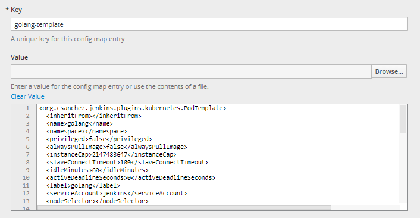
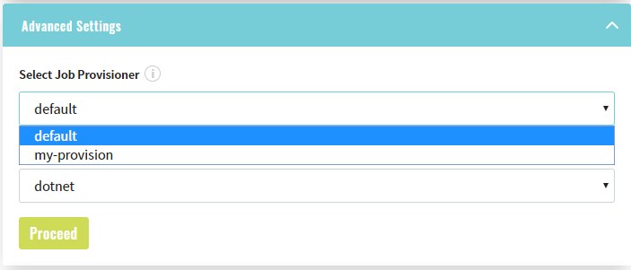

# EDP Jenkins Operator

## Overview
The Jenkins operator creates, deploys and manages the EDP Jenkins instance on Kubernetes/OpenShift. The Jenkins instance is equipped with the necessary plugins. 

There is an ability to customize the Jenkins instance and to check the changes during the application creation.

## Add Jenkins Slave

Follow the steps below to add a new Jenkins slave:

1. Add a new template for Jenkins Slave by navigating to the jenkins-slaves config map under the EDP namespace. Fill in the Key field and add a value:


2. Open Jenkins to ensure that everything is added correctly. Click the Manage Jenkins option, navigate to the Configure System menu, and scroll down to the Kubernetes Pod Template with the necessary data: 


3. As a result, the newly added Jenkins slave will be available in the Advanced Settings block of the Admin Console tool during the codebase creation:

  
---

## Add Other Code Language

There is an ability to extend the default code languages when creating a codebase with the clone strategy.  


_**NOTE**: The create strategy does not allow to customize the default code language set._
 
In order to customize the Build Tool list, perform the following:
1. Navigate to OpenShift, and edit the edp-admin-console deployment config map by adding the necessary code language into the BUILD TOOLS field. 


_**NOTE**: Use the comma sign to separate the code languages in order to make them available, e.g. maven, gradle._ 

---

## Add Job Provision

Jenkins uses the job provisions pipelines to create the application folder, and the code-review, build and create-release pipelines for the application.
These pipelines should be located in a special job-provisions folder in Jenkins. By default, the Jenkins operator creates the default pipeline that is used for Maven, Gradle, and DotNet applications.

Follow the steps below to add a new job provision:
1. Open Jenkins and add an item into the job-provisions, scroll down to the _Copy from_ field and enter "default", type the name of a new job-provision and click ENTER:

2. The new job provision will be added with the following default template:  

```java
import groovy.json.*
import jenkins.model.Jenkins

Jenkins jenkins = Jenkins.instance
def stages = [:]

stages['Code-review-application'] = '[{"name": "gerrit-checkout"},{"name": "compile"},{"name": "tests"},' +
        '{"name": "sonar"}]'
stages['Code-review-library'] = '[{"name": "gerrit-checkout"},{"name": "compile"},{"name": "tests"},' +
        '{"name": "sonar"}]'
stages['Code-review-autotests'] = '[{"name": "gerrit-checkout"},{"name": "tests"},{"name": "sonar"}]'
stages['Code-review-default'] = '[{"name": "gerrit-checkout"}]'

stages['Build-library-maven'] = '[{"name": "checkout"},{"name": "get-version"},{"name": "compile"},' +
        '{"name": "tests"},{"name": "sonar"},{"name": "build"},{"name": "push"},{"name": "git-tag"}]'
stages['Build-library-npm'] = stages['Build-library-maven']
stages['Build-library-gradle'] = stages['Build-library-maven']
stages['Build-library-dotnet'] = '[{"name": "checkout"},{"name": "get-version"},{"name": "compile"},' +
        '{"name": "tests"},{"name": "sonar"},{"name": "push"},{"name": "git-tag"}]'

stages['Build-application-maven'] = '[{"name": "checkout"},{"name": "get-version"},{"name": "compile"},' +
        '{"name": "tests"},{"name": "sonar"},{"name": "build"},{"name": "build-image"},' +
        '{"name": "push"},{"name": "git-tag"}]'
stages['Build-application-npm'] = stages['Build-application-maven']
stages['Build-application-gradle'] = stages['Build-application-maven']
stages['Build-application-dotnet'] = '[{"name": "checkout"},{"name": "get-version"},{"name": "compile"},' +
        '{"name": "tests"},{"name": "sonar"},{"name": "build-image"},' +
        '{"name": "push"},{"name": "git-tag"}]'

stages['Create-release'] = '[{"name": "checkout"},{"name": "create-branch"},{"name": "trigger-job"}]'

def buildToolsOutOfTheBox = ["maven","npm","gradle","dotnet"]
def defaultBuild = '[{"name": "checkout"}]'

def codebaseName = "${NAME}"
def buildTool = "${BUILD_TOOL}"
def gitServerCrName = "${GIT_SERVER_CR_NAME}"
def gitServerCrVersion = "${GIT_SERVER_CR_VERSION}"
def gitCredentialsId = "${GIT_CREDENTIALS_ID ? GIT_CREDENTIALS_ID : 'gerrit-ciuser-sshkey'}"
def repositoryPath = "${REPOSITORY_PATH}"

def codebaseFolder = jenkins.getItem(codebaseName)
if (codebaseFolder == null) {
    folder(codebaseName)
}

createListView(codebaseName, "Releases")
createReleasePipeline("Create-release-${codebaseName}", codebaseName, stages["Create-release"], "create-release.groovy",
        repositoryPath, gitCredentialsId, gitServerCrName, gitServerCrVersion)

if (BRANCH) {
    def branch = "${BRANCH}"
    createListView(codebaseName, "${branch.toUpperCase()}")

    def type = "${TYPE}"
    def supBuildTool = buildToolsOutOfTheBox.contains(buildTool.toString())
    def crKey = supBuildTool ? "Code-review-${type}" : "Code-review-default"
    createCiPipeline("Code-review-${codebaseName}", codebaseName, stages.get(crKey), "code-review.groovy",
            repositoryPath, gitCredentialsId, branch, gitServerCrName, gitServerCrVersion)

    def buildKey = "Build-${type}-${buildTool.toLowerCase()}".toString()
    if (type.equalsIgnoreCase('application') || type.equalsIgnoreCase('library')) {
        createCiPipeline("Build-${codebaseName}", codebaseName, stages.get(buildKey, defaultBuild), "build.groovy",
                repositoryPath, gitCredentialsId, branch, gitServerCrName, gitServerCrVersion)
    }
}

def createCiPipeline(pipelineName, codebaseName, codebaseStages, pipelineScript, repository, credId, watchBranch = "master", gitServerCrName, gitServerCrVersion) {
    pipelineJob("${codebaseName}/${watchBranch.toUpperCase()}-${pipelineName}") {
        logRotator {
            numToKeep(10)
            daysToKeep(7)
        }
        triggers {
            gerrit {
                events {
                    if (pipelineName.contains("Build"))
                        changeMerged()
                    else
                        patchsetCreated()
                }
                project("plain:${codebaseName}", ["plain:${watchBranch}"])
            }
        }
        definition {
            cpsScm {
                scm {
                    git {
                        remote {
                            url(repository)
                            credentials(credId)
                        }
                        branches("${watchBranch}")
                        scriptPath("${pipelineScript}")
                    }
                }
                parameters {
                    stringParam("GIT_SERVER_CR_NAME", "${gitServerCrName}", "Name of Git Server CR to generate link to Git server")
                    stringParam("GIT_SERVER_CR_VERSION", "${gitServerCrVersion}", "Version of GitServer CR Resource")
                    stringParam("STAGES", "${codebaseStages}", "Consequence of stages in JSON format to be run during execution")
                    stringParam("GERRIT_PROJECT_NAME", "${codebaseName}", "Gerrit project name(Codebase name) to be build")
                    if (pipelineName.contains("Build"))
                        stringParam("BRANCH", "${watchBranch}", "Branch to build artifact from")
                }
            }
        }
    }
}

def createReleasePipeline(pipelineName, codebaseName, codebaseStages, pipelineScript, repository, credId, gitServerCrName, gitServerCrVersion) {
    pipelineJob("${codebaseName}/${pipelineName}") {
        logRotator {
            numToKeep(14)
            daysToKeep(30)
        }
        definition {
            cpsScm {
                scm {
                    git {
                        remote {
                            url(repository)
                            credentials(credId)
                        }
                        branches("master")
                        scriptPath("${pipelineScript}")
                    }
                }
                parameters {
                    stringParam("STAGES", "${codebaseStages}", "")
                    if (pipelineName.contains("Create-release")) {
                        stringParam("GERRIT_PROJECT", "${codebaseName}", "")
                        stringParam("RELEASE_NAME", "", "Name of the release(branch to be created)")
                        stringParam("COMMIT_ID", "", "Commit ID that will be used to create branch from for new release. If empty, HEAD of master will be used")
                        stringParam("GIT_SERVER_CR_NAME", "${gitServerCrName}", "Name of Git Server CR to generate link to Git server")
                        stringParam("GIT_SERVER_CR_VERSION", "${gitServerCrVersion}", "Version of GitServer CR Resource")
                        stringParam("REPOSITORY_PATH", "${repository}", "Full repository path")
                    }
                }
            }
        }
    }
}

def createListView(codebaseName, branchName) {
    listView("${codebaseName}/${branchName}") {
        if (branchName.toLowerCase() == "releases") {
            jobFilters {
                regex {
                    matchType(MatchType.INCLUDE_MATCHED)
                    matchValue(RegexMatchValue.NAME)
                    regex("^Create-release.*")
                }
            }
        } else {
            jobFilters {
                regex {
                    matchType(MatchType.INCLUDE_MATCHED)
                    matchValue(RegexMatchValue.NAME)
                    regex("^${branchName}-(Code-review|Build).*")
                }
            }
        }
        columns {
            status()
            weather()
            name()
            lastSuccess()
            lastFailure()
            lastDuration()
            buildButton()
        }
    }
}
``` 
The job-provisions pipeline consists of the following parameters:

* NAME - the application name;
* TYPE - the codebase type (the application / library / autotest); 
* BUILD_TOOL - a tool that is used to build the application;
* BRANCH - a branch name;
* GIT_SERVER_CR_NAME - the name of the application Git server custom resource 
* GIT_SERVER_CR_VERSION - the version of the application Git server custom resource
* GIT_CREDENTIALS_ID - the secret name where Git server credentials are stored (default 'gerrit-ciuser-sshkey');
* REPOSITORY_PATH - the full repository path.

_**NOTE**: The default template should be changed if there is another creation logic for the code-review, build and create-release pipelines.
Furthermore, all pipeline types should have the necessary stages as well._

3.Check the availability of the job-provision in the Advanced Settings block during the codebase creation: 

 